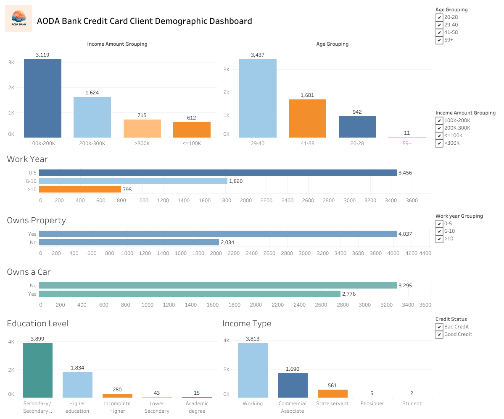

## Dashboard

An interactive Tableau dashboard built to explore the demographic 
and credit profile of bank clients.

### Preview

### What the Dashboard Shows
- Income amount distribution by client group
- Age group breakdown of credit card clients
- Work year experience grouping
- Property and car ownership rates
- Education level and income type breakdown
- Filterable by Age Group, Income Group, Work Year, and Credit Status

### View Live Dashboard
🔗 [Click here to view on Tableau Public](https://public.tableau.com/views/DEEPPProjectDashboard/AODABankCreditCardClientDemographicDashboard?:language=en-US&:sid=&:redirect=auth&:display_count=n&:origin=viz_share_link)
